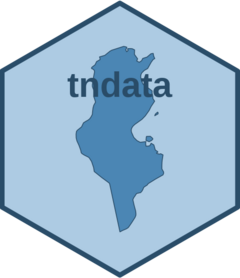

<!-- README.md is generated from README.Rmd. Please edit that file -->

```{r, include = FALSE}
knitr::opts_chunk$set(
  collapse = TRUE,
  comment = "#>",
  fig.path = "man/figures/README-",
  out.width = "100%"
)
```

# tndata <a href="http://aymennasri.me/tndata/"></a>

<!-- badges: start -->
[](https://cran.r-project.org/package=tndata)
<!-- badges: end -->

## Overview

The tndata package simplifies access to Tunisian government open data with R. It queries datasets by theme, author, or keywords, retrieves metadata, and gets structured results ready for analysis; all through the official [data.gov.tn](https://data.gov.tn/fr/) CKAN API.

## Installation

You can install the latest version of tndata from [CRAN](https://cran.r-project.org/package=tndata) with:

``` r
# install.packages("pak")
pak::pak("tndata")
```

## Example

``` r
library(tndata)

download_dataset("Ressources en eau- Gouvernorat de Kasserine", format = "xls")
```
